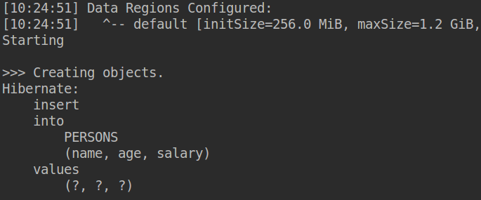

</br>
</br>
</br>
</br>
</br>
</br>
</br>
</br>
</br>
</br>
</br>


<center> <h1>Internship Report</h1> </center>
<center> <h2>Apache Ignite</h2> </center>
<center> <h2>Mehmet Ozan Güven</h2> </center>
<center> <h3>Internship Date: 2018.06.20 – 2018.09.18</h3> </center>
</br>
</br>

# Table of Contents
1. What is Apache Ignite <span style="float:right;">-p 3 </span>

2. Why we need Apache Ignite <span style="float:right;">-p 3 </span>

4. Apache Ignite Installation&Simple Project <span style="float:right;">-p 6 </span>

5. Apache Ignite Memory Data Grid <span style="float:right;">-p 16 </span>
    * CacheStore Interface <span style="float:right;">-p 18 </span>

6. Cache with Apache Ignite Simple Example<span style="float:right;">-p 23</span>

7. Apache Ignite with Hibernate<span style="float:right;">-p 39 </span>
    * Used Ignite as Hibernate L2 Cache <span style="float:right;">-p 40 </span>
    * CacheStore with Hibernate <span style="float:right;">-p 46 </span>

8. Synchronization between Ignite Nodes (IgniteCountDownLatch) <span style="float:right;">-p 52 </span>
9. Questions about Apache Ignite  <span style="float:right;">-p 58 </span>
10. Apache Storm and Ignite	Example  <span style="float:right;">-p 61 </span>
</br>
</br>
</br>
</br>
</br>
</br>
</br>
</br>
###### 2018.06.20 – 2018.06.22
# What is Apache Ignite
Apache Ignite is an open source memory-centric distributed database, caching and processing platform.

It can store and process a large volume of data in memory and disk by its durable memory architecture where durable memory means that it treats not just RAM also complete fully functional storage layer.

One of the advantages in Apache Ignite is distributed computing. Ignite provides a set of simple APIs that allows a user to distribute computation and data processing across multiple nodes in the cluster to gain high performance. The main difference between other technologies is the quantity of functionality and simplicity of use and it provides a variety of functionalities.

It is also very useful to develop and execute microservice architecture.

# Why we need Apache Ignite?
Because we need high performance to improve applications, reduce production cost, decrease development times.

We can achieve 2-3x times performance of a workstation by aggregating a few computers together in one grid. However, if we have to achieve 10-20x performance, then we need different solution which is in-memory computing where primarily relies on keeping data in server’s RAM as a means of processing at faster speeds.

</br>
###### 2018.06.25 – 2018.06.29

## Durable Memory Architecture
Apache Ignite memory-centric platform is based on the durable memory architecture that allows storing and processing data and indexing in both memory and disk.

This architecture helps us to achieve in-memory performance with the durability of disk.

Here is the durable memory modes:</br>
&ensp;&ensp;&ensp;&ensp; **1)In-Memory :** The whole data set is stored in memory. Because of data is never written in disk, we can achieve the best performance.</br>
&ensp;&ensp;&ensp;&ensp; __Use-cases :__ real-time processing of continuous data stream, in-memory computations, web-session caching</br>

&ensp;&ensp;&ensp;&ensp; __2) In-Memory + 3rd party database :__ In this mode, ignite is used as caching layer above an existing 3rd party database such as RDBMS, NoSQL. This mode is used to  accelerate the underlying database.</br>
&ensp;&ensp;&ensp;&ensp; **Use-cases :** adds acceleration to existing database.</br>

&ensp;&ensp;&ensp;&ensp; **3) In-Memory + Full copy on disk :** The whole data set is stored in memory and disk. The disk is used for data recovery purposes in case of full cluster crashes and restarts.</br>
&ensp;&ensp;&ensp;&ensp; **Use-cases :** Ignite as an in-memory database provides SQL, key-value and collocated processing APIs to in-memory data</br>

&ensp;&ensp;&ensp;&ensp; **4) 100% on Disk + In-Memory cache :**
100% data is stored and smaller subset of data is cached in memory</br>
&ensp;&ensp;&ensp;&ensp; **Use-cases :** Ignite as an memory-centric-distributed-database provides cloud native distributed database with SQL, key-value and collocated processing APIs.</br>

## Apache Ignite Features
Data grid, Compute grid, Service grid, Bigdata accelerator, Streaming grid</br>


## Apache Ignite Architecture
In traditional system, application architecture:</br>


This architecture is useful for data consistency and durability. But there could be a lot of transaction waiting in the queue.

Application architecture in-memory:</br>


We add additional layer to the environment which uses RAM of the server to store most of all data required by the application. In-memory grid stands between servers and data store. It uses cache of frequently accessed data by client and also it can access the persistence store when it is needed.

This approach reduces the response time, and application can support concurrent transactions.

## Apache Ignite with Event Processing & Real-Time analysis
Traditional data management system can not process big data fast enough to notify the important events.

Let’s say we want to detect errors about online credit card such as fraud or we can detect the meaningful patterns from datas in our business. For example, we want to detect login and logout time for business network. If there is abnormal event in any time, system administrator can be notified. The difference from traditional approach is that notification can be send continuously, rather than analyzing data after it’s reached.

## Apache Ignite with BigData
Hadoop has been widely used for big data processing where Hadoop is an open source framework that allows us to store and process big data in a distributed environment across clusters of computers. However, it is a disk-based data storage, therefore it is unsuitable for use in real-time data.

An alternative is to store the needed distributed data within the memory.

###### 2018.06.25 – 2018.06.29
# Apache Ignite Installation&Simple Project
We need these technologies:</br>
&ensp;&ensp;&ensp;&ensp; JDK 1.7 or above </br>
&ensp;&ensp;&ensp;&ensp; Apache Ignite Source File</br>
&ensp;&ensp;&ensp;&ensp; IDE (I will use IntelliJ)</br>
&ensp;&ensp;&ensp;&ensp; Note that: All operation will be done in Ubuntu&LinuxMint OS</br>

## 1) Download and Install Apache Ignite
&ensp;&ensp;&ensp;&ensp; Download apache ignite [here](https://ignite.apache.org/download.cgi) . I am going to use version 2.5.0</br>
&ensp;&ensp;&ensp;&ensp; Then unzip the file to installation location</br>
&ensp;&ensp;&ensp;&ensp; If needed, we can set environment variable to  point to installation folder</br>

## 2) Start Ignite
Go to installation folder and type in terminal:</br>

&ensp;&ensp;&ensp;&ensp; For Linux: `$ bin/ignite.sh examples/config/example-ignite.xml` </br>

&ensp;&ensp;&ensp;&ensp; For Windows: `$ bin\ignite.bat   examples\config\example-ignite.xml`</br>

After all terminal will look like this:</br>


We can start as many as node via opening new terminal writing command again.</br>

## 3) Create maven project
&ensp;&ensp;&ensp;&ensp; Create maven project in IDE</br>

&ensp;&ensp;&ensp;&ensp; Add these dependencies to the pom.xml:</br>


## 4) Set VM option
This step is required. Go to Run → Edit Configuration → VM options and write</br>

` -DIGNITE_HOME=<path-to-apacheIgnite-installation-file>`</br>
for my project it is:</br>

`-DIGNITE_HOME=/home/nova-stats/Desktop/ApacheIgniteInstallationFolder/apache-ignite-fabric-2.5.0-bin`</br>

## 5) Create HelloIgnite.java
Here is the code: </br>

```java
import org.apache.ignite.Ignite;
import org.apache.ignite.IgniteException;
import org.apache.ignite.Ignition;
import org.apache.ignite.cluster.ClusterGroup;
import org.apache.ignite.lang.IgniteClosure;
import org.apache.ignite.lang.IgniteRunnable;

import java.util.Arrays;
import java.util.Collection;
import java.util.List;

public class HelloIgnite {
    private Ignite ignite;

    public void startIgnite(String configurationFilePath){

        ignite = null;

        try{
            ignite = Ignition.start(configurationFilePath);
        }
        catch(IgniteException e) {
            e.printStackTrace();
        }
    }

    public void broadCastToAllNodes(String message){
        if (ignite != null)
            ignite.compute().broadcast(new MessageSender(message));
        else
            System.out.println("Error occurred");
    }

    public void sendMessageToRemoteNodes(String message){

        if (ignite != null){
            ClusterGroup remoteNodes = ignite.cluster().forRemotes();
            ignite.compute(remoteNodes).broadcast(new MessageSender(message));
        }
        else
            System.out.println("Error occurred");

    }

    public static void main(String[] args) {
       HelloIgnite helloIgnite = new HelloIgnite();
        helloIgnite.startIgnite(
        "/home/nova-stats"+
        "Desktop/ApacheIgniteInstallationFolder/apache-ignite-fabric-2.5.0-bin"+
        "examples/config/example-ignite-xml");
        String message_for_broadcast = "Hello All Ignite Nodes";
        String message_for_remoteNodes = "Hello Remote Ignite Nodes";
        helloIgnite.broadCastToAllNodes(message_for_broadcast);
        helloIgnite.sendMessageToRemoteNodes(message_for_remoteNodes);
    }

    private class MessageSender implements IgniteRunnable{
        private String message;

        public MessageSender(String message){
            this.message = message;
        }

        @Override
        public void run() {
            System.out.println("This message will be sent all the nodes: " +
                    message);
        }
    }
}
```

This code send the message all nodes in cluster and send the message just remote nodes. When we run this file outputs will be:</br>


</br>
### Why do we need configuration file?
One question could be why we need configuration file, if we remove configuration file from code above, we can not run the code correctly.  To understand the reason of the configuration file, we should look at the xml fileclosely.

When we open the examples/config/example-ignite.xml file which is inside Apache Ignite installation folder. We will see:

```xml
<?xml version="1.0" encoding="UTF-8"?>

<!--
  Licensed to the Apache Software Foundation (ASF) under one or more
  contributor license agreements.  See the NOTICE file distributed with
  this work for additional information regarding copyright ownership.
  The ASF licenses this file to You under the Apache License, Version 2.0
  (the "License"); you may not use this file except in compliance with
  the License.  You may obtain a copy of the License at

       http://www.apache.org/licenses/LICENSE-2.0

  Unless required by applicable law or agreed to in writing, software
  distributed under the License is distributed on an "AS IS" BASIS,
  WITHOUT WARRANTIES OR CONDITIONS OF ANY KIND, either express or implied.
  See the License for the specific language governing permissions and
  limitations under the License.
-->

<!--
    Ignite configuration with all defaults and enabled p2p deployment
    and enabled events.
-->
<beans xmlns="http://www.springframework.org/schema/beans"
       xmlns:xsi="http://www.w3.org/2001/XMLSchema-instance"
       xsi:schemaLocation="http://www.springframework.org/schema/beans
        http://www.springframework.org/schema/beans/spring-beans.xsd">
    <!-- Imports default Ignite configuration -->
    <import resource="example-default.xml"/>

    <bean parent="ignite.cfg"/>
</beans>
```
This configuration file imports the another xml file which is example-default.xml and inherits the ignite.cfg bean.
When we open the examples/config/example-default.xml (We can see the whole xml document from the apache github address, for example-default.xml can be found [here](https://github.com/apache/ignite/blob/master/examples/config/example-default.xml)), we will see:

```xml
<?xml version="1.0" encoding="UTF-8"?>

<!--
  Licensed to the Apache Software Foundation (ASF) under one or more
  contributor license agreements.  See the NOTICE file distributed with
  this work for additional information regarding copyright ownership.
  The ASF licenses this file to You under the Apache License, Version 2.0
  (the "License"); you may not use this file except in compliance with
  the License.  You may obtain a copy of the License at

       http://www.apache.org/licenses/LICENSE-2.0

  Unless required by applicable law or agreed to in writing, software
  distributed under the License is distributed on an "AS IS" BASIS,
  WITHOUT WARRANTIES OR CONDITIONS OF ANY KIND, either express or implied.
  See the License for the specific language governing permissions and
  limitations under the License.
-->

<!--
    Ignite configuration with all defaults and enabled p2p deployment and
    enabled events.
-->
<beans xmlns="http://www.springframework.org/schema/beans"
       xmlns:xsi="http://www.w3.org/2001/XMLSchema-instance"
       xmlns:util="http://www.springframework.org/schema/util"
       xsi:schemaLocation="
        http://www.springframework.org/schema/beans
        http://www.springframework.org/schema/beans/spring-beans.xsd
        http://www.springframework.org/schema/util
        http://www.springframework.org/schema/util/spring-util.xsd">
    <bean abstract="true" id="ignite.cfg" class=
      "org.apache.ignite.configuration.IgniteConfiguration">
        <!-- Set to true to enable distributed class loading for examples,
         default is false. -->
        <property name="peerClassLoadingEnabled" value="true"/>

        <!-- Enable task execution events for examples. -->
        <property name="includeEventTypes">
            <list>
                <!--Task execution events-->
                <util:constant static-field=
                  "org.apache.ignite.events.EventType.EVT_TASK_STARTED"/>
                <util:constant static-field=
                  "org.apache.ignite.events.EventType.EVT_TASK_FINISHED"/>
                <util:constant static-field=
                  "org.apache.ignite.events.EventType.EVT_TASK_FAILED"/>
                <util:constant static-field=
                  "org.apache.ignite.events.EventType.EVT_TASK_TIMEDOUT"/>
                <util:constant static-field=
                "org.apache.ignite.events.EventType.EVT_TASK_SESSION_ATTR_SET"/>
                <util:constant static-field=
                  "org.apache.ignite.events.EventType.EVT_TASK_REDUCED"/>

                <!--Cache events-->
                <util:constant static-field=
                  "org.apache.ignite.events.EventType.EVT_CACHE_OBJECT_PUT"/>
                <util:constant static-field=
                  "org.apache.ignite.events.EventType.EVT_CACHE_OBJECT_READ"/>
                <util:constant static-field=
                "org.apache.ignite.events.EventType.EVT_CACHE_OBJECT_REMOVED"/>
            </list>
        </property>

        <!-- Explicitly configure TCP discovery SPI to provide
        list of initial nodes. -->
        <property name="discoverySpi">
            <bean class="org.apache.ignite.spi.discovery.tcp.
                            TcpDiscoverySpi">
                <property name="ipFinder">
                    <!--
                        Ignite provides several options for automatic
                        discovery that can be used
                        instead os static IP based discovery.
                        For information on all options refer
                        to our documentation:
                        http://apacheignite.readme.io/docs/cluster-config
                    -->
                    <!-- Uncomment static IP finder to enable static-based
                    discovery of initial nodes. -->
                    <!--<bean class=
    "org.apache.ignite.spi.discovery.tcp.ipfinder.vm.TcpDiscoveryVmIpFinder">-->
                    <bean class=
"org.apache.ignite.spi.discovery.tcp.ipfinder.multicast.
                                  TcpDiscoveryMulticastIpFinder">
                        <property name="addresses">
                            <list>
                                <!-- In distributed environment, replace with
                                actual host IP address. -->
                                 <value>127.0.0.1:47500..47509</value>
                            </list>
                        </property>
                    </bean>
                </property>
            </bean>
        </property>
    </bean>
</beans>
```
</br>
```xml
<bean abstract="true" id="ignite.cfg" class=
  "org.apache.ignite.configuration.IgniteConfiguration">

```
which tells us: this bean is used to group common properties(abstract=”true”) and it is instance of IgniteConfiguration class.</br>

```xml
<property name="peerClassLoadingEnabled" value="true"/>
```

We set variable peerClassLoadingEnabled to true which is false in default. Thanks to set to true, our code in the above will run in all nodes.</br>

```xml
<property name="includeEventTypes">
    <list>
        <!--Task execution events-->
        <util:constant static-field=
          "org.apache.ignite.events.EventType.EVT_TASK_STARTED"/>
        <util:constant static-field=
          "org.apache.ignite.events.EventType.EVT_TASK_FINISHED"/>
        <util:constant static-field=
          "org.apache.ignite.events.EventType.EVT_TASK_FAILED"/>
        <util:constant static-field=
          "org.apache.ignite.events.EventType.EVT_TASK_TIMEDOUT"/>
        <util:constant static-field=
          "org.apache.ignite.events.EventType.EVT_TASK_SESSION_ATTR_SET"/>
        <util:constant static-field=
          "org.apache.ignite.events.EventType.EVT_TASK_REDUCED"/>

        <!--Cache events-->
        <util:constant static-field=
          "org.apache.ignite.events.EventType.EVT_CACHE_OBJECT_PUT"/>
        <util:constant static-field=
          "org.apache.ignite.events.EventType.EVT_CACHE_OBJECT_READ"/>
        <util:constant static-field=
          "org.apache.ignite.events.EventType.EVT_CACHE_OBJECT_REMOVED"/>
    </list>
</property>

```
We set the variable int[] inclEvtTypes. Therefore we can do some operation in some steps. For example, before start the task run some method(s).</br>

```xml
<property name="discoverySpi">
    <bean class="org.apache.ignite.spi.discovery.tcp.TcpDiscoverySpi">
        <property name="ipFinder">
            <!--
                Ignite provides several options for automatic
                discovery that can be used
                instead os static IP based discovery.
                For information on all options refer
                to our documentation:
                http://apacheignite.readme.io/docs/cluster-config
            -->
            <!-- Uncomment static IP finder to enable static-based
            discovery of initial nodes. -->
            <!--<bean class=
"org.apache.ignite.spi.discovery.tcp.ipfinder.vm.TcpDiscoveryVmIpFinder">-->
            <bean class=
"org.apache.ignite.spi.discovery.tcp.ipfinder.multicast.
                                              TcpDiscoveryMulticastIpFinder">
                <property name="addresses">
                    <list>
                        <!-- In distributed environment, replace with
                        actual host IP address. -->
                         <value>127.0.0.1:47500..47509</value>
                    </list>
                </property>
            </bean>
        </property>
    </bean>
</property>

```
For nodes to discover each other we have used DiscoverySPI where TcpDiscoverySpi is the default implementation.</br>

###### 2018.07.02 – 2018.07.06

## Apache Ignite Memory Data Grid
Ignite  provides extensive and rich key-value APIs and can act as an in memory data grid. We can think of Ignite as of a distributed partitioned hash map with every cluster node owning a portion of the overall data set.

Ignite in-memory data grid can improve performance and scalability of existing 3rd party databases by sliding in as a distribute cache between the application and database layers. This approach will automatically write-through or read-through all the updates or reads to or from the underlying database.
Ignite key-value APIs comply with JCache specification that supports the following:</br>
&ensp;&ensp;&ensp;&ensp; In-Memory Key Value Store</br>
&ensp;&ensp;&ensp;&ensp; Basic Cache Operations</br>
&ensp;&ensp;&ensp;&ensp; ConcurrentMap APIs</br>
&ensp;&ensp;&ensp;&ensp; Collocated Processing</br>
&ensp;&ensp;&ensp;&ensp; Event and Metrics</br>
&ensp;&ensp;&ensp;&ensp; Pluggable Persistence</br>
In addition to the stardant JCache API, Ignites supports distributed ACID transaction, scan and continuous queries, collocated processing and more.
### Caching with Apache Ignite
Ignite database caching is implemented in the data grid component. It enables users to keep the most frequently accessed data in memory, by either partitioning or replicating it across cluster of computers.</br>

**Partitioned Mode**</br>

&ensp;&ensp;&ensp;&ensp;In this mode, the whole data set is divided equally into partitions and all partitions are split equally between participating nodes.  With this mode, updates become cheap because only one primary node need to be updated for every key.</br>

**Replicated Mode**</br>

&ensp;&ensp;&ensp;&ensp;In this mode, all data is replicated to every node in the cluster. However, in this mode every data update must be propagated to all other nodes.  In Ignite, replicated caches are implemented in the way similar to partitioned caches where every key has a primary copy and is  also backed up on all other nodes in the cluster.<br>

**Local Mode**</br>

&ensp;&ensp;&ensp;&ensp;This mode is ideal for scenarios where data is either read-only, or can be periodically refreshed at some expiration frequency.


##### 3rd Party Persistence Caching
In JCache, there is a CacheLoader interface for read-through, and there is a CacheWriter interface for write-through. These are responsible for reading and writing data from and to an underlying persistent storage.</br>

Even if Ignite allows us to configure CacheLoader and CacheWriter separately, Ignite provides CacheStore interface which extends both, CacheLoader and CacheWriter.

Write-Through & Read-Through

&ensp;&ensp;&ensp;&ensp;In this case, when the application updates a piece of data in the cache (that is, calls put(...) to change a cache entry,) the operation will not complete (that is, the put will not return) until it has gone through the CacheStore and successfully stored the data to the underlying data source. This is called *write-through*.

&ensp;&ensp;&ensp;&ensp;When an application asks the cache for an entry, for example the key X, and X is not already in the cache, it will automatically delegate to the CacheStore and ask it to load X from the underlying data source. If X exists in the data source, it will be load it, and return the proper place.This is called *Read-Through*.

&ensp;&ensp;&ensp;&ensp;To configure write-through and read-through, we need to implement the CacheStore interface and set cacheStoreFactory as well as readThrough and writeThrough properties of CacheConfiguration.

Write-Behind

&ensp;&ensp;&ensp;&ensp;In a simple write-through mode, each put and remove operation in cache also will involve corresponding request to the persistent store and therefore the total duration of the cache update might be long.

&ensp;&ensp;&ensp;&ensp;To solve that, Ignite offers an option which is write-behind to perform asynchronous persistent store update. This approach is that: collect the updates and then asynchronously flush them to the underlying database as bulk operation. We can set trigger the database by time-based events (the maximum time that data entry can reside in the queue is limited), by queue-size events (the queue is flushed when it’s size reaches some particular point) or by using both of them in combination.(Note that → only the last update to an entry will be written to the underlying storage. If key is sequentially updated with values value1 and value2, then pair key value2 pair will be propagated to the persistent store).

&ensp;&ensp;&ensp;&ensp;Finally Write-Behind caching can be enabled via the CacheConfiguration.setWriteBehindEnabled(boolean) property.

To understand better we should look CacheStore interface

#### CacheStore Interface :

1. ##### loadCache() :
We can load values from underlying persistent storage. It is up to implementation to figure out what to load.</br>
This method is called whenever IgniteCache.loadCache(…) method is invoked which is usually to preload the cache from persistent storage.

2. ##### load():
This methods are used to enable read-through and write-through behavior when working with individual cache entries.</br>
It is called whenever IgniteCache.get() method is called.

3. ##### write():
This methods are used to enable read-through and write-through behavior when working with individual cache entries.</br>
It is called whenever IgniteCache.put() method is called.

4. ##### delete():
This methods are used to enable read-through and write-through behavior when working with individual cache entries.</br>
It is called whenever IgniteCache.remove() method is called.

5. ##### loadAll(), writeAll(), deleteAll():
These methods are used to enable read-through and write-through behavior when working with multiple cache entires.</br>
These methods are called whenever getAll(), putAll() and removeAll() are called correspondingly on the IgniteCache interface.</br>
*Note that → CacheStoreAdapter(abstract class) provides default implementation for loadAll(), writeAll() and deleteAll() methods which simply iterates through all keys one by one.*

6. **sessionEnd()**:</br>
Sessions are especially useful when working with transactions.
In case of ATOMIC caches, method sessionEnd() is called after completion of each CacheStore method. In case of TRANSACTIONAL caches, sessionEnd() is called at the end of each transaction.
</br>
</br>
</br>
&ensp;&ensp;&ensp;&ensp;Well, if everything goes correctly data will be updated and nodes can read the new data in a right way. However in reality, there could be some problems, for example, let’s say cache1 wants to update Person object in its cache memory and in database, at the same another cache2 wants to read that Person object. Then question is how we can be sure that cache2 will read the correct Person. To solve that problem Ignite provides Transactional mode.

Here is the difference between ATOMIC and TRANSACTIONAL mode:


</br>

**IgniteTransactions** interface provides 3 different overloaded methods to start transactions:

1. **txStart()** → Starts transaction with default isolation, concurrency, timeout and invalidation policy.

2. **txStart(TransactionConcurrency concurrency, TransactionIsolation isolation)** → Starts new transaction with the specified concurrency and isolation.

3. **txStart(TransactionConcurrency concurrency, TransactionIsolation isolation, long timeout, int txSize)** → Starts transaction with specified concurrency, isolation, timeout, invalidation flag and a number of participating entries.

Transaction concurrencies available in Ignite: *PESSIMISTIC or OPTIMISTIC*.

Transaction isolation in Ignite: *READ_COMMITED, REPETABLE_READ and SERIALIZABLE*

##### Pessimistic  Lock
It blocks database records for a single user, until the lock is releases.
Offers a higher integrity than optimistic lock.
May cause a deadlock in a bad application desing (lock is never released).

##### Optimistic Lock
With this locking, every row in a database has its own version number.
When reading the object, the version number is retrieved.
When changing the object and trying to persist the change, checks the version numbers that was held by first access and current version in the database.
If there is no change, the object can be written in the database.
If there is a change, the transaction is canceled.

Here is the example to better understand pessimistic and optimistic locks

*With Pessimistic lock*

* User 1 reads a record and locks it.
* User 2 attempts to read and lock the same record, but must wait.
* User 1 updates the record and commits
* User 2 can now read the record with the changes that User 1 made
* User 2 updates the record complete.

*With Optimistic lock*
* User 1 reads the record and retrieve version number(1)
* User 2 reads the record and retrieve version number(1)
* User 1 attempts to update the record. It has version number 1 and database version number is also 1.  Therefore, no problem, User 1 updates the record and version number also be updated with new version number let’s say 2.
* User 2 attempts to update the record. It has the version number 1 and database version number is 2.
* Therefore, there is a problem. Now, User 2 must re-read the record again from database and must update the its version number to 2. Then try to update the record again.

**Transaction Isolation Level**

Transaction isolation levels specify what data is visible to statements within a transaction. These levels directly impact the level of concurrent access by defining what interaction is possible between transactions against the same target data source.

Transaction isolation levels are defined by the following phenomena

* **Dirty Read** → Occurs when:</br>
  &ensp;&ensp;&ensp;&ensp;Transaction A inserts a row into a table</br>
	&ensp;&ensp;&ensp;&ensp;Transaction B reads the new row</br>
	&ensp;&ensp;&ensp;&ensp;Transaction A rolls back</br>
	&ensp;&ensp;&ensp;&ensp;Transaction B may have done work to the system based on the row inserted by transaction A, but that row never became a permanent part of the database.</br>

* **Nonrepeatable** →Occurs when:</br>
	&ensp;&ensp;&ensp;&ensp;Transaction A reads a row</br>
	&ensp;&ensp;&ensp;&ensp;Transaction B changes the row</br>
	&ensp;&ensp;&ensp;&ensp;Transaction A reads the same row a second time and gets the new results.</br>

* **Phantom** → Occurs when:</br>
	&ensp;&ensp;&ensp;&ensp;Transaction A reads all rows that satisfy a WHERE clause.</br>
	&ensp;&ensp;&ensp;&ensp;Transaction B inserts an additional row that satisfies the WHERE clause.</br>
	&ensp;&ensp;&ensp;&ensp;Transaction A re-evaluates the WHERE condition and gets the different row.

Here is the picture about how READ_COMMITED, REPETABLE_READ and SERIALIZABLE work on these phenomena:


From the picture above Serializable is the most convenient choose.

##### Transaction Commit Protocols in Ignite
Ignite provides 2 types of commit protocols: One-phase commit (1p) and Two-phase commit(2p)

Ignite automatically decides when to use 1-phase or 2-phase. The decision mainly depends on Ignite cache mode configuration: Partitioned or Replicated mode.

In Ignite, whenever we use Replicated cache mode with more than 2 nodes, the commit protocol will always 2p commit.

1-phase commit:

For using 1p commit protocol in  Partitioned mode, we have to fulfill the following condition:

&ensp;&ensp;&ensp;&ensp;Backup copy must be 1

&ensp;&ensp;&ensp;&ensp;Cache entries participate in a transaction must reside in the same partition.(Using affinity key)


2- phase commit

&ensp;&ensp;&ensp;&ensp;In 2p commit, there is one more phase called *prepare* .


Whenever a client initiates a commit request to Ignite node, the coordinator node sends a prepare message to the primary nodes of the data.

Primary node after acquiring the proper locks, synchronously send the prepare messages to all the nodes holding the backup copy of the data.  

Every backup copy nodes reply with the messages yes on prepare request.

When every yes vote is collected from the backup nodes, a commit message is sent, and the transaction gets committed.

After research, I have decided to use OPTIMISTIC for transaction mode because in PESSIMISTIC deadlock occurrence is higher than in OPTIMISTIC, and SERIALIZABLE for transaction isolation because dirty read, nonrepeatable and phatom can not occur.

# Cache with Apache Ignite Simple Example

In this example I will:
* Read the data from database and store the cache
* Delete record from the cache and also from the database
* Update record in a cache and database.

and I will use:
* Postgresql for database
* IntelliJ as an ide

## 1) Install postgresql
* Install via this link from [here](https://www.postgresql.org/download/linux/ubuntu/ "Postgresql Ubuntu")
* Or using command line :
```script
$ sudo apt-get install postgresql postgresql-contrib
```
## 2) Create database in postgresql
Because of I am using Linux Mint, I have followed the linux commands. Here is the commands:
Access the postgres via :
```script
$ sudo -u postgres psql
```
*Note that → Default there is no password in postgres. However, I have experienced with some error in the code because of “no password for database”.  Therefore recommended set the password.*

To set a password use this command (for postgres):
```script
ALTER USER postgres PASSWORD 'password';
```

After the first command, terminal looks like :


Create Database via :
```SQL
CREATE DATABASE database_name;
```

then connect that database via :
```script
postgres=# \c yourDatabaseName
```

Then, create a table, I have created table :
```SQL
CREATE TABLE PERSONS(
			id SERIAL PRIMARY KEY,
			name TEXT,
			age int,
			salary decimal
		);
```
where id is the primary key and auto-increment.

Then I have added some records:

`insert into PERSONS(name, age, salary) values ('Ozan', 23, 3800);`

`insert into PERSONS(name, age, salary) values ('Kerem',33, 2500);`

`insert into PERSONS(name, age, salary) values ('Aslı', 22, 3100);`

`insert into PERSONS(name, age, salary) values ('Deniz', 27, 1000);`


| id            | name          | age   | salary |
| ------------- |:-------------:| -----:| -----: |
| 1             | Ozan          | 23    | 3800   |
| 2             | Kerem         | 33    | 2500   |
| 3             | Aslı          | 22    | 3100   |
| 4             | Deniz         | 27    | 1000   |

## 3) Create maven project:
Add this dependencies:


Here is the configuration file for cache:

```xml
<beans xmlns="http://www.springframework.org/schema/beans"
       xmlns:xsi="http://www.w3.org/2001/XMLSchema-instance"
       xmlns:util="http://www.springframework.org/schema/util"
       xsi:schemaLocation="
        http://www.springframework.org/schema/beans
        http://www.springframework.org/schema/beans/spring-beans.xsd
        http://www.springframework.org/schema/util
        http://www.springframework.org/schema/util/spring-util.xsd">

    <bean class="org.apache.ignite.configuration.IgniteConfiguration"
                                                              id="ignite.cfg">
        <property name="cacheConfiguration">
            <list>
                <bean
                  class="org.apache.ignite.configuration.CacheConfiguration">
                    <!--set the cache name-->
                    <property name="name" value="personCache"></property>

                    <!--set the read through property-->
                    <property name="readThrough" value="true"></property>

                    <!--set the write through property-->
                    <property name="writeThrough" value="true"></property>

                    <!--enable the write behind-->
                    <property name="writeBehindEnabled" value="true"></property>

                    <!--cache mode is REPLICATED-->
                    <property name="cacheMode" value="REPLICATED"/>

                    <!--set transactional mode (ACID Compliant)-->
                    <property name="atomicityMode" value="TRANSACTIONAL"/>

                    <!--Sets factory for persistent storage for cache data-->
                    <property name="cacheStoreFactory">
                        <!--this bean says that factory builder will be
                        PersonStore class-->
                        <bean class="javax.cache.configuration.FactoryBuilder"
                          factory-method="factoryOf">
                            <constructor-arg value="PersonStore">
                                                            </constructor-arg>
                        </bean>
                    </property>

                    <!--set the query entities-->
                    <property name="queryEntities">
                        <list>
                            <bean class="org.apache.ignite.cache.QueryEntity">
                                <property name="keyType"
                                  value="java.lang.Integer">
                                </property>
                                <property name="valueType"
                                  value="Person"></property>
                                <property name="fields">
                                    <map>
                                        <entry key="id"
                                          value="java.lang.Integer"></entry>
                                        <entry key="name"
                                          value="java.lang.String"></entry>
                                        <entry key="age"
                                          value="java.lang.Integer"></entry>
                                        <entry key="age"
                                          value="java.lang.Double"></entry>
                                    </map>
                                </property>
                            </bean>
                        </list>
                    </property>
                </bean>
            </list>
        </property>

        <!-- Set to true to enable distributed class loading for examples,
        default is false. -->
        <property name="peerClassLoadingEnabled" value="true"/>

        <!-- Enable task execution events for examples. -->
        <property name="includeEventTypes">
            <list>
                <!--Task execution events-->
                <util:constant static-field=
                  "org.apache.ignite.events.EventType.EVT_TASK_STARTED"/>
                <util:constant static-field=
                  "org.apache.ignite.events.EventType.EVT_TASK_FINISHED"/>
                <util:constant static-field=
                  "org.apache.ignite.events.EventType.EVT_TASK_FAILED"/>
                <util:constant static-field=
                  "org.apache.ignite.events.EventType.EVT_TASK_TIMEDOUT"/>
                <util:constant
                  static-field=
                  "org.apache.ignite.events.EventType.EVT_TASK_SESSION_ATTR_SET"
                  />
                <util:constant static-field=
                  "org.apache.ignite.events.EventType.EVT_TASK_REDUCED"/>

                <!--Cache events-->
                <util:constant
                  static-field=
                  "org.apache.ignite.events.EventType.EVT_CACHE_OBJECT_PUT"/>
                <util:constant
                  static-field=
                  "org.apache.ignite.events.EventType.EVT_CACHE_OBJECT_READ"/>
                <util:constant
                  static-field=
                  "org.apache.ignite.events.EventType.EVT_CACHE_OBJECT_REMOVED"
                  />
            </list>
        </property>

        <!-- Explicitly configure TCP discovery SPI to provide
        list of initial nodes. -->
        <property name="discoverySpi">
            <bean class="org.apache.ignite.spi.discovery.tcp.TcpDiscoverySpi">
                <property name="ipFinder">
                    <!--
                        Ignite provides several options for automatic
                        discovery that can be used
                        instead os static IP based discovery.
                    -->
                    <!-- Uncomment static IP finder to enable static-based
                    discovery of initial nodes. -->
                    <!--<bean class="org.apache.ignite.spi.
                    discovery.tcp.ipfinder.vm.TcpDiscoveryVmIpFinder">-->
                    <bean class=
                "org.apache.ignite.spi.discovery.tcp.ipfinder.multicast.Tc
                    pDiscoveryMulticastIpFinder">
                        <property name="addresses">
                            <list>
                                <!-- In distributed environment,
                                replace with actual host IP address. -->
                                <value>127.0.0.1:47500..47509</value>
                            </list>
                        </property>
                    </bean>
                </property>
            </bean>
        </property>
    </bean>
</beans>
```

Let's take close look this xml file:

```xml
<bean class="org.apache.ignite.configuration.IgniteConfiguration"
  id="ignite.cfg">
```

Here is our bean and it is instance of IgniteConfiguration.


```xml
<property name="cacheConfiguration">
```

Then we set the cacheConfiguration variable in the IgniteConfiguration class.

```xml
<list>
    <bean class=
      "org.apache.ignite.configuration.CacheConfiguration">
      ...
    </list>
```

this cacheConfiguration variable is a list and we set element to the list which instance of CacheConfiguration.

```xml
<!--set the cache name-->
<property name="name" value="personCache"></property>

<!--set the read through property-->
<property name="readThrough" value="true"></property>

<!--set the write through property-->
<property name="writeThrough" value="true"></property>

<!--enable the write behind-->
<property name="writeBehindEnabled" value="true">
</property>

<!--cache mode is REPLICATED-->
<property name="cacheMode" value="REPLICATED"/>

<!--set transactional mode (ACID Compliant)-->
<property name="atomicityMode" value="TRANSACTIONAL"/>
```

We give a name to our CacheConfiguration which is personCache

Then we set the readThrough, writeThrough, writeBehindEnabled property to true.

Then set the cache mode replicated therefore all cache nodes will have the whole data.

Then for ACID compliant we set the atomicityMode to TRANSACTIONAL.

```xml
<!--Sets factory for persistent storage for cache data-->
<property name="cacheStoreFactory">
    <!--this bean says that factory builder will be
    PersonStore class-->
    <bean class="javax.cache.configuration.FactoryBuilder"
      factory-method="factoryOf">
        <constructor-arg value="PersonStore"></constructor-arg>
    </bean>
</property>
```
From the above, I have said that for using persistent storage there are CacheLoader and CacheWriter classes. Fortunately, Ignite combines them together with CacheStore and this xml file sets the CacheStore which is PersonStore class.


```xml
<!--set the query entities-->
<property name="queryEntities">
    <list>
        <bean class="org.apache.ignite.cache.QueryEntity">
            <property name="keyType" value="java.lang.Integer"></property>
            <property name="valueType" value="Person"></property>
            <property name="fields">
                <map>
                    <entry key="id" value="java.lang.Integer"></entry>
                    <entry key="name" value="java.lang.String"></entry>
                    <entry key="age" value="java.lang.Integer"></entry>
                    <entry key="age" value="java.lang.Double"></entry>
                </map>
            </property>
        </bean>
    </list>
</property>
```

This part defines the query properties, I have decided that in cache key is the integer, value is the Person object.

Here is the PersonStore class:

*Note that: Transaction transaction ;* Ignition.ignite().transactions().txStart(TransactionConcurrency.OPTIMISTIC,TransactionIsolation.SERIALIZABLE)

*have to be Transaction transaction =* Ignition.ignite().transactions().txStart(TransactionConcurrency.OPTIMISTIC,TransactionIsolation.SERIALIZABLE)

*because of code highlighter I have forced to do.*

```java
import org.apache.ignite.Ignition;
import org.apache.ignite.cache.store.CacheStoreAdapter;
import org.apache.ignite.lang.IgniteBiInClosure;
import org.apache.ignite.transactions.Transaction;
import org.apache.ignite.transactions.TransactionConcurrency;
import org.apache.ignite.transactions.TransactionIsolation;
import org.apache.ignite.transactions.
TransactionOptimisticException;

import javax.cache.Cache;
import javax.cache.integration.CacheLoaderException;
import javax.cache.integration.CacheWriterException;
import java.sql.*;

public class PersonStore extends
        CacheStoreAdapter<Integer, Person> {
          ...
    }
```

As I said, cache key is the integer and value is the Person Object.

```java
/**
     * Postgres JDBC connection method
     * For my example:
     * PERSONS table is in testdb database
     * and testdb database password is 1234
     * @return connection
     */
    private Connection connectTheDatabase(){
        Connection databaseConnection = null;

        try{
            databaseConnection = DriverManager.
                    getConnection("jdbc:postgresql:" +
                            "//localhost:5432/" +
                            "testdb", "postgres", "1234");

        }
        catch (SQLException e){
            e.printStackTrace();
        }
        return databaseConnection;
    }
```

Postgres jdbc Connection

```java
/**
     * It is called	whenever IgniteCache.loadCache(...) method is called.
     * This is method is used to load datas
     * to cache from database
     * In my example, I decided to load all the
     * person in the persons table
     * @param clo
     * @param args
     */
     public void loadCache(IgniteBiInClosure<Integer, Person> clo,
                                                      Object args){

       System.out.println("Loading the all database to the cache");
       Connection postgresConnection = connectTheDatabase();

      while(true){
        try(Transaction transaction ;
        Ignition.ignite().transactions().txStart(
        TransactionConcurrency.OPTIMISTIC,
        TransactionIsolation.SERIALIZABLE)){


          PreparedStatement sqlStatement =
                postgresConnection.prepareStatement("select * from PERSONS");
                ResultSet queryResult = sqlStatement.executeQuery();
                Person person = null;
                while(queryResult.next()){
                    int personID = queryResult.getInt(1);
                    String personName = queryResult.getString(2);
                    int personAge = queryResult.getInt(3);
                    double personSalary = queryResult.getDouble(4);

                    person = new Person(
                                    personID,
                                    personName,
                                    personAge,
                                    personSalary);
                    clo.apply(personID, person);
                }
                transaction.commit();
                break;
            }
            catch(SQLException | TransactionOptimisticException e){
                e.printStackTrace();
          }
      }

     }
```
 I have used this method to load datas from the database.

```java
/**
    * It is called	whenever IgniteCache.get(key) method is called.
    * Key is the person id.
    * This is method is used to load single data to cache from database
    * @param key comes from  IgniteCache.get() method
    * @return Person object from the database. If there is match,
    * otherwise returns null
    */
   @Override
   public Person load(Integer key) throws CacheLoaderException {
       System.out.println("New Person object is loading to cache"+
                          "from database...");

       Connection postgresConnection = connectTheDatabase();

       while(true){
           try(Transaction transaction ; Ignition.ignite().transactions().
                   txStart(TransactionConcurrency.OPTIMISTIC,
                           TransactionIsolation.SERIALIZABLE)){
               PreparedStatement sqlStatement = postgresConnection.
                       prepareStatement("select * from PERSONS where id = ?");
               sqlStatement.setInt(1, key);
               ResultSet queryResult = sqlStatement.executeQuery();
               Person person = getPersomFromQueryResult(queryResult);
               transaction.commit();
               return person;
           }
           catch(SQLException | TransactionOptimisticException e){
               e.printStackTrace();
           }
       }
   }

```

I have used this method to load a single person object to cache.

```java
/**
    * It is called	whenever IgniteCache.put(Person person) method is called.
    * When cache is updated with new Person,
    *      first check the person is in the database
    *      If it is then update the person in database.
    *      If not, add this person to the database (new row)
    * @param entry is the parameter that is Person object
    */
   @Override
   public void write(Cache.Entry<? extends Integer, ? extends Person> entry)
   throws CacheWriterException {
       Connection postgresConnection = connectTheDatabase();
       Person person = entry.getValue();
       int isUpdated = 0;

       while(true){
           try(Transaction transaction ; Ignition.ignite().transactions().
                   txStart(TransactionConcurrency.OPTIMISTIC,
                           TransactionIsolation.SERIALIZABLE)){

               PreparedStatement sqlStatement = postgresConnection.
                       prepareStatement("update PERSONS set
                        salary = ? where id = ?");
               sqlStatement.setDouble(1, person.getSalary());
               sqlStatement.setInt(2, person.getPersonID());
               isUpdated = sqlStatement.executeUpdate();

               if (isUpdated == 0){
                   sqlStatement = postgresConnection.
                           prepareStatement("insert into PERSONS
                           (name, age, salary) values (?, ?, ?)");
                   sqlStatement.setString(1, person.getName());
                   sqlStatement.setInt(2, person.getAge());
                   sqlStatement.setDouble(3, person.getSalary());
                   sqlStatement.executeUpdate();
               }
               transaction.commit();
               break;

           }
           catch (SQLException | TransactionOptimisticException e){

               e.printStackTrace();
           }
       }
   }
```

I have used this method to put element in the cache and also database.

```java
/**
     * It is called	whenever IgniteCache.remove() method is	called.
     * Remove person from cache and database
     * @param key is the person id
     * @throws CacheWriterException
     */
    @Override
    public void delete(Object key) throws CacheWriterException {
        Connection postgresConnection = connectTheDatabase();

        while(true){
            try(Transaction transaction ; Ignition.ignite().transactions().
            txStart(TransactionConcurrency.OPTIMISTIC,
            TransactionIsolation.SERIALIZABLE)){
                PreparedStatement sqlStatement =
                postgresConnection.prepareStatement("delete from "+
                "PERSONS where id = ?");
                int key_int = Integer.parseInt(String.valueOf(key));
                sqlStatement.setInt(1, key_int);
                sqlStatement.executeUpdate();
                transaction.commit();
                break;

            }
            catch (SQLException | TransactionOptimisticException e){
                e.printStackTrace();
            }
        }

    }
```
;
Remove data from cache and database.

And also there is person class to store datas.
`
```java
public class Person {

    private int personID;
    private String name;
    private int age;
    private double salary;

    public Person(int personID,
                  String name,
                  int age,
                  double salary){
        this.name = name;
        this.age = age;
        this.personID = personID;
        this.salary = salary;
    }
    /*
    and Getters, setters methods.
    */
}
```
Here is the main app

```java
public static void printCache(IgniteCache igniteCache){
    int cacheSize = igniteCache.size();
    for (int i = 1; i <= cacheSize; i++){
        System.out.println(igniteCache.get(i));
    }
}

public static void main(String[] args) {


    String igniteCacheConfFilePath = "/home/nova-stats" +
            "/Desktop/Apache Ignite" +
            "/CacheWithApacheIgnite/src/main/resources/ignite-cache.xml";

    Ignite ignite = IgniteFactory.createIgniteNodeWithSpecificConfiguration(
            "s", igniteCacheConfFilePath);
    try{
        final IgniteCache<Integer, Person> igniteCache =
                ignite.getOrCreateCache("personCache");
        igniteCache.loadCache(null);
        printCache(igniteCache);

    }
    catch (IgniteException e){
        e.printStackTrace();
    }
}
```
First run this code, and output will be:


Now remove igniteCache.loadCache(null), add new Person to the cache memory via igniteCache.put(person) and delete any person from the cache via igniteCache.remove(1) (I will remove first person from the cache, and add new Person(5, "Ali", 20, 1850)), then create new node (run the main app) here is the output:


now let's look at the database:

in postgresql terminal screen write:

```SQL
SELECT * FROM PERSONS;
```

here is the output

| id            | name          | age   | salary |
| ------------- |:-------------:| -----:| -----: |
| 2             | Kerem         | 33    | 2500   |
| 3             | Aslı          | 22    | 3100   |
| 4             | Deniz         | 27    | 1000   |
| 5             |Ali            |20     | 1850   |

Here we can see that database has also been updated.

###### 2018.07.16 – 2018.07.20
# Apache Ignite with Hibernate

**IMPORTANT! Hibernate is LGPL-licensed, therefore we need to add 3rd party repository to local maven depository. For more information [here](http://ignite.apache.org/download.cgi#build-source)**

**If ignite-hibernate_5.1 will be used, then use Hibernate 5**
**If ignite-hibernate_4.1 will be used, then use Hibernate 4**

*Note: I am going to use Person class in the above*
### Example 1) Used Ignite as Hibernate L2 Cache
Hibernate only uses per-session (L1) cache, so, objects, cached in one session, are not seen in another by default.

If we want objects to be seen in all the session we need to enable second level (L2) cache. This gives us greater performance.

L1 cache is fully implemented by Hibernate. However L2 cache can be implemented by different technologies such as Ehcache, Ignite.

Steps for second level cache:

1. Add Ignite libraries to your application's classpath.
2. Enable L2 cache and specify Ignite implementation class in L2 cache configuration.
3. Configure Ignite caches for L2 cache regions and start the Ignite node.

Our purpose is:

When an object is first read from the database, it is immediately stored in L2 cache (which is Ignite In-Memory Data Ignite cluster in fact). Further requests of the same object only read the data from L2 cache and do not hit the database.
##### 1) Hibernate Configuration file:
Here is the hibernate config file(hibernate.cfg.xml):
```xml
<hibernate-configuration>
    <session-factory>
        <property name="hibernate.dialect">
            org.hibernate.dialect.PostgreSQL94Dialect
        </property>

        <property name="hibernate.connection.driver_class">
            org.postgresql.Driver
        </property>

        <property name="hibernate.connection.url">
            jdbc:postgresql://localhost:5432/testdb
        </property>
        <property name="hibernate.connection.username">
            postgres
        </property>
        <property name="hibernate.connection.password">
            1234
        </property>

        <!-- Enable L2 cache. -->
        <property name="cache.use_second_level_cache">true</property>

        <!-- Generate L2 cache statistics. -->
        <property name="generate_statistics">true</property>

        <!-- Specify Ignite as L2 cache provider. -->
        <property name="cache.region.factory_class">
            org.apache.ignite.cache.hibernate.HibernateRegionFactory</property>

        <!-- Specify the name of the grid, that will be used
        for second level caching. -->
        <property name="org.apache.ignite.hibernate.ignite_instance_name">
            hibernate-grid</property>

        <!-- Set default L2 cache access type. -->
        <property name="org.apache.ignite.hibernate.default_access_type">
            READ_ONLY</property>

        <property name="show_sql">true</property>
        <property name="format_sql">true</property>

        <mapping resource="Person.hbm.xml"/>

        <class-cache class="Person" usage="read-only"/>
    </session-factory>
</hibernate-configuration>
```
##### 2) Mapping Configuration file:
Here is the mapping configuration(Person.hbm.xml):

```xml
<?xml version = "1.0" encoding = "utf-8"?>
<!DOCTYPE hibernate-mapping PUBLIC
        "-//Hibernate/Hibernate Mapping DTD//EN"
        "http://www.hibernate.org/dtd/hibernate-mapping-3.0.dtd">

<hibernate-mapping default-access="field">
    <class name="Person" table="PERSONS">


        <id name="personId" type="int" column="id">
            <generator class="identity"/>
        </id>

        <property name="personName" column="name"
          type="string"/>
        <property name="personAge" column="age"
          type="int"/>
        <property name="personSalary" column="salary"
          type="double"/>

    </class>
</hibernate-mapping>
```
##### 3) Ignite Configuration File
*Note that: igniteInstanceName have to be same as in the hibernate configuration file.*
```xml
<beans xmlns="http://www.springframework.org/schema/beans"
       xmlns:xsi="http://www.w3.org/2001/XMLSchema-instance"
       xmlns:util="http://www.springframework.org/schema/util"
       xsi:schemaLocation="
        http://www.springframework.org/schema/beans
        http://www.springframework.org/schema/beans/spring-beans.xsd
        http://www.springframework.org/schema/util
        http://www.springframework.org/schema/util/spring-util.xsd">


    <bean id="ignite.cfg" class="org.apache.ignite.configuration.
      IgniteConfiguration">
        <property name="igniteInstanceName" value="hibernate-grid"/>

        <property name="cacheConfiguration">
            <list>
                <bean class="org.apache.ignite.configuration.CacheConfiguration"
                  >
                    <property name="name" value="Person"/>
                    <property name="cacheMode" value="REPLICATED"/>
                    <property name="atomicityMode" value="TRANSACTIONAL"/>
                    <property name="writeSynchronizationMode" value="FULL_SYNC"
                      />
                </bean>

            </list>

        </property>
    <!-- Default configuration is here ... -->
  </bean>
</beans>
```
##### 4) Download ExamplesUtils Class
For resolved URL, download [ExamplesUtils](https://github.com/apache/ignite/blob/master/examples/src/main/java/org/apache/ignite/examples/ExamplesUtils.java) class from Apache github address.

##### 5) MainApp
Here is the main app
```java
public class MainApp {
  private static final String HIBERNATE_CFG = "hibernate.cfg.xml";
    private static final String PERSON_CACHE_NAME = "Person";


    public static SessionFactory createHibernateSessionFactory(URL hibernateCfg)
    {
        StandardServiceRegistryBuilder builder =
                                      new StandardServiceRegistryBuilder();
        builder.configure(hibernateCfg);
        return new MetadataSources(builder.build()).buildMetadata().
                                        buildSessionFactory();
    }
    public static void printStats(SessionFactory sesFactory) {
        System.out.println("=== Hibernate L2 cache statistics ===");
        System.out.println("\tEntity: " + PERSON_CACHE_NAME);

        SecondLevelCacheStatistics stats =
                sesFactory.getStatistics().
                        getSecondLevelCacheStatistics(PERSON_CACHE_NAME);
        System.out.println("\t\tPuts: " + stats.getPutCount());
        System.out.println("\t\tHits: " + stats.getHitCount());
        System.out.println("\t\tMisses: " + stats.getMissCount());
        System.out.println("=====================================");
    }
    public static void main(String[] args){
       String specificIgniteConfigPath = "/home/nova-stats/IdeaProjects" +
               "/FinalHibernate/src/main/resources/ignite-configuration.xml";

       Ignite ignite = IgniteFactory.
               createIgniteNodeWithSpecificConfiguration
               ("s", specificIgniteConfigPath);
       System.out.println("Starting");

       IgniteCache igniteCache = ignite.getOrCreateCache("Person");

       URL hibernateCfg = ExamplesUtils.url(HIBERNATE_CFG);
       //should be sesFactory = createHibernateSessionFactory(...)
        try (SessionFactory sesFactory ; createHibernateSessionFactory
        (hibernateCfg)){
          System.out.println();
            System.out.println(">>> Creating objects.");

            final int userId;

            Session ses = sesFactory.openSession();

            try {
                Transaction tx = ses.beginTransaction();
                Person user = new Person("Test", 34, 1234);
                ses.save(user);
                tx.commit();
                userId = user.getPersonId();
            }
            finally {
                ses.close();
            }
            System.out.println();
            System.out.println(">>> Querying object by ID.");

            for (int i = 0; i < 3; i++) {
                ses = sesFactory.openSession();
                try {
                    Transaction tx = ses.beginTransaction();
                    Person user = (Person)ses.get(Person.class, userId);

                    System.out.println("----------------");
                    System.out.println("User: " + user);
                    System.out.println("----------------");

                    tx.commit();
                }
                finally {
                    ses.close();
                }
            }  
            printStats(sesFactory);

        }
     }
}

```

Now when I create ignite node, first it will add new data to database (Person user ..., ses.save(user) ) and output will be:



Then, scenario will like this: Let's say I want to access this object (user) several times. First time, it will be taken from database, then it will be stored L2 cache. Second and third time, it will be taken from L2 cache,  therefore there will be no need to run same query again and again.

When it is taken from database:


We can see the query

For second and third time:


L2 cache statistics tells us:

* First time, data is not in L2 cache ->  Misses:1
* Data is put in the L2 cache -> Puts:1
* Second & Third time, data is in th L2 cache -> Hits:2


### Example 2) CacheStore with Hibernate
```xml
<hibernate-configuration>
    <session-factory>
        <property name="hibernate.dialect">
            org.hibernate.dialect.PostgreSQL94Dialect
        </property>
        <property name="hibernate.connection.driver_class">
            org.postgresql.Driver
        </property>
        <property name="hibernate.connection.url">
            jdbc:postgresql://localhost:5432/testdb
        </property>
        <property name="hibernate.connection.username">
            postgres
        </property>
        <property name="hibernate.connection.password">
            1234
        </property>
        <property name="hbm2ddl.auto">update</property>
        <property name="show_sql">false</property>
        <mapping resource="Person.hbm.xml"/>
    </session-factory>
</hibernate-configuration>
```


Mapping configuration file is the same as in example 1(Person.hbm.xml)

When implementing CacheStore, we need CacheStoreSession, because for example when we want to connect ongoing database we need to use CacheStoreSession.attach()

To inject CacheStoreSession to CacheStore class:

```java
public class PersonStore extends CacheStoreAdapter<Integer, Person> {
  @CacheStoreSessionResource
  private CacheStoreSession ses;
  public Person load(Integer key) throws CacheLoaderException {
        System.out.println("Load method....\n\n\n");
        System.out.println(">>> Store load [key=" + key + ']');

        Session hibernateSession = ses.attachment();

        try {
            return (Person) hibernateSession.get(Person.class, key);
        } catch (HibernateException e) {
            throw new CacheLoaderException("Failed to load value"+"
             from cache store [key=" + key + ']', e);
        }
  }
}
    // and other implementation -> delete, loadCache, write..
```  

and I have used default configuration file for Ignite, I have done some specific settings for cache in programmatically way.

Here is the that part:

```java
public static CacheConfiguration prepareCacheConfiguration(){
        CacheConfiguration<Integer, Person> ccfg = new CacheConfiguration();
        ccfg.setName("personCache");
        ccfg.setAtomicityMode(CacheAtomicityMode.TRANSACTIONAL);
        ccfg.setCacheMode(CacheMode.REPLICATED);
        ccfg.setReadThrough(true);
        ccfg.setWriteThrough(true);
        ccfg.setWriteSynchronizationMode(FULL_SYNC);
        ccfg.setOnheapCacheEnabled(true);
        ccfg.setEvictionPolicyFactory(
        new LruEvictionPolicyFactory<Integer, Person>(2));
        ccfg.setStatisticsEnabled(true);
        ccfg.setCacheStoreFactory(FactoryBuilder.factoryOf(PersonStore.class));

        ccfg.setCacheStoreSessionListenerFactories(
        new Factory<CacheStoreSessionListener>() {

            public CacheStoreSessionListener create() {

                CacheHibernateStoreSessionListener
                                      cacheHibernateStoreSessionListener=
                new CacheHibernateStoreSessionListener();
                cacheHibernateStoreSessionListener.
                setHibernateConfigurationPath(HIBERNATE_CFG_FULL_PATH);
                return cacheHibernateStoreSessionListener;
            }
        });
        return ccfg;
    }
```
**1) WriteSynchronizationMode**: If the number of backups is 1, then every key in the cache will has 2 copies, 1 primary and 1 backup

To update the backup nodes we set the writeSynchronizationMode which tells Ignite whether the client node should wait for responses from backup nodes, before completing a write or commit.

For my example I have decided to use FULL_SYNC:

&ensp;&ensp;&ensp;&ensp;When client node has done some update(s) in the cache, client node will wait for write or commit replies from all nodes(primary and backup)

**2) setOnheapCacheEnabled** Also I have decided to use eviction policy (LRU-Least Recently Used). To implement that I have to enable on-heap cache.

**3) new LruEvictionPolicyFactory<Integer, Person>(2):** says max on-heap entry cache size can be 2.

**4) CacheStoreSessionListener** -> Store can be invoked one or several times during one session, then we have to create a connection when session is started and commit or rollback when session is finished.

Cache Store session listener allows us to implement this.

**5) CacheHibernateStoreSessionListener** -> hibernate based session listener.

**6) HIBERNATE_CFG_FULL_PATH** is the hibernate config file path.

I have added listener to listen eviction event in cache
```java
public static void listenForEviction(Ignite ignite){
        ignite.events().localListen(new IgnitePredicate<Event>() {
            @Override
            public boolean apply(Event event) {
                System.out.println("\nReceiving event is: " + event + "\n");
                return true;
            }
        }, EventType.EVT_CACHE_ENTRY_EVICTED);
    }
```
Here is the main app

I am going to load 3 entry in database to the cache.

```java
public static void main(String[] args) {
      Ignite ignite = IgniteFactory.
                    createIgniteNodeWithSpecificConfiguration("s",configPath);
      IgniteCache igniteCache = ignite.
                      getOrCreateCache(prepareCacheConfiguration());
      listenForEviction(ignite);
      igniteCache.loadCache(null, 3);
      printCache(igniteCache);
}
```

**configPath** is the ignite configuration file path.

The output:


As we can see, first time there were objects Ozan and Kerem in the on heap. Then we add third object to the cache. Because of LRU policy object Ozan will removed from on-heap.

We can closer look on-heap and off-heap entry via GridGain console.

To do that:
1. Add [ignite-rest](https://mvnrepository.com/artifact/org.apache.ignite/ignite-rest-http) maven dependency to the pom.xml.
2. Register  [grid gain web console ](https://console.gridgain.com/configuration/advanced/clusters), download and unzip it.
3. After running ignite node, go to zip folder and type in terminal:

```script
nova-stats@ubuntu:~/Desktop/Apache Ignite/ignite-web-agent-2.4.4$
./ignite-web-agent.sh
```

Output:


Click the https://console.gridgain.com

Here is the on-heap and off-heap entry size for cache:


*Note that: LRU policy is on-heap eviction policy. This policy removes the cache entries from Java heap only. The entries stored in the off-heap region of the memory are not affected.*

Also we can look at the node(s) in our cluster:


Now let's delete one entry in the cache and also database:

After running first node, now I have created another node:

```java
public static void main(String[] args) {
        Ignite ignite = IgniteFactory.
        createIgniteNodeWithSpecificConfiguration("s",path);
        IgniteCache igniteCache = ignite.getOrCreateCache("personCache");
        listenForEviction(ignite);

        deleteData(1, ignite);
    }
```

I don't need to say prepareCacheConfiguration(), I just pass the cache name, because when I create in first node, this cache will deploy all the nodes.

**deleteData(1, ignite)** will delete data in cache which key is 1.

These function will go to the PersonStore class and will run the this method:

```java
public void delete(Object key) throws CacheWriterException {
        System.out.println("Delete method...\n\n\n");
        System.out.println(">>> Store delete [key=" + key + ']');

        System.out.println();
        Session hibernateSession = ses.attachment();

        try {

            hibernateSession.createQuery("delete " +
             Person.class.getSimpleName() + " where id = :id").
                    setParameter("id", key).
                    executeUpdate();
        }
        catch (HibernateException e) {
            throw new CacheWriterException("Failed to remove value"+"
             from cache store [key=" + key + ']', e);
        }
    }
```

Before running second node, database:

| id            | name          | age   | salary |
| ------------- |:-------------:| -----:| -----: |
| 1             | Ozan          | 23    | 3800   |
| 2             | Kerem         | 33    | 2500   |
| 3             | Aslı          | 22    | 3100   |
| 4             | Deniz         | 27    | 1000   |


After running second node, database:

| id            | name          | age   | salary |
| ------------- |:-------------:| -----:| -----: |
| 2             | Kerem         | 33    | 2500   |
| 3             | Aslı          | 22    | 3100   |
| 4             | Deniz         | 27    | 1000   |

Finally dependencies for this project:

```xml
<dependencies>
        <dependency>
            <groupId>org.hibernate.javax.persistence</groupId>
            <artifactId>hibernate-jpa-2.0-api</artifactId>
            <version>1.0.1.Final</version>
        </dependency>
        <dependency>
            <groupId>org.apache.ignite</groupId>
            <artifactId>ignite-core</artifactId>
            <version>2.5.0</version>
        </dependency>
        <dependency>
            <groupId>org.apache.ignite</groupId>
            <artifactId>ignite-spring</artifactId>
            <version>2.5.0</version>
        </dependency>
        <dependency>
           <groupId>org.apache.ignite</groupId>
           <artifactId>ignite-hibernate_5.1</artifactId>
           <version>2.5.0</version>
       </dependency>
       <dependency>
           <groupId>org.apache.ignite</groupId>
           <artifactId>ignite-rest-http</artifactId>
           <version>2.5.0</version>
       </dependency>
       <dependency>
           <groupId>org.hibernate</groupId>
           <artifactId>hibernate-core</artifactId>
           <version>5.1.0.Final</version>
       </dependency>
       <dependency>
           <groupId>postgresql</groupId>
           <artifactId>postgresql</artifactId>
           <version>9.1-901-1.jdbc4</version>
       </dependency>
   </dependencies>
```
###### 2018.07.23 – 2018.07.27
# Synchronization between Ignite Nodes (IgniteCountDownLatch)

Ignite provides IgniteCountDownLatch to synchronize nodes across cluster.

To create CountDownLatch in Ignite:
```Java
Ignite node = IgniteFactory.
            createIgniteNodeWithDefaultConfiguration("s");

IgniteCountDownLatch latch = node.countDownLatch(
            "simpleLatch",
            5,
            false,
            true
);
```
First parameter is the latch name.
Second parameter is initial count of latch.
Third parameter is for auto remove. If it is true, when counter has reach 0, latch will be removed.
Fourth parameter is for creation. If it is true, it will create a latch if does not exists.

If you want a node to wait other nodes(some operation), use
`latch.await()`

I am going to present 2 examples(CachePeekMode and CacheMetrics). In both example:
* I run the publisher node and wait until all cache datas load.
* Then create a client node, it will wait until consumer node gets all cache datas(wait until backup operation is done)
* I will create a Consumer node, when backup operation is done, consumer node will decrease the latch. Then, client will get the datas.

Firstly I have configured cache in the xml file for Publisher node.

```xml
<bean id="ignite.cfg"
	class="org.apache.ignite.configuration.IgniteConfiguration">
<!-- default configurations -->
<property name="cacheConfiguration">
            <list>
              <bean
       class="org.apache.ignite.configuration.CacheConfiguration">
                    <property name="name" value="sampleCache"/>
                    <property name="cacheMode" value="REPLICATED"/>
                </bean>
            </list>
  </property>
  <!-- default configurations -->
</bean>
```

Publisher node configuration is the same for both examples:
```java
public static void populateCache(IgniteCache igniteCache){
        for (int i = 0; i < 1000000; i++){
            igniteCache.put(i, String.valueOf(i));
        }
    }

    public static void main(String[] args) {
        Ignite publisher = IgniteFactory.
                createIgniteNodeWithSpecificConfiguration("s",
                                      PUBLISHER_CONFIG_PATH);

        IgniteCache igniteCache = publisher.getOrCreateCache("sampleCache");

        populateCache(igniteCache);
        System.out.println(igniteCache.size());

    }
```

Also Client node configuration is the same for both examples:
```Java
public static void main(String[] args) {
        Ignite client = IgniteFactory.
               createIgniteNodeWithDefaultConfiguration("c");


        IgniteCountDownLatch latch = client.countDownLatch("simpleLatch",
                                                        1,
                                                false,
                                                true);
        IgniteCache igniteCache = client.getOrCreateCache("sampleCache");
        System.out.println("Client is waiting for Consumer nodes");

        latch.await();


        System.out.println("Now client can get values");
        System.out.println(igniteCache.get(999999));
    }
```

## Example 1 - Using CachePeekMode

Here is the Consumer node:

```java
public static void main(String[] args) throws
                                    InterruptedException {
        Ignite consumer = IgniteFactory.
                createIgniteNodeWithDefaultConfiguration("s");

        IgniteCache igniteCache = consumer.getOrCreateCache("sampleCache");
        TimeUnit.SECONDS.sleep(6);
        IgniteCountDownLatch igniteCountDownLatch = consumer.
                       countDownLatch("simpleLatch",
                                           1,
                                   false,
                                       true);

        int backupEntryCount= igniteCache.size(CachePeekMode.BACKUP);
        int primaryEntryCount = igniteCache.size(CachePeekMode.PRIMARY);


        if (backupEntryCount == primaryEntryCount && backupEntryCount != 0){
            System.out.println("Consumer saw that backup entry count " +
                           "and primary count are equal");
            System.out.println("Now, Consumer decrements the count "+
                        "of the latch.");

                   igniteCountDownLatch.countDown();
        }
}
```

1. Run the Publisher node and wait until `  System.out.println(igniteCache.size());`. Now, Publisher node is ready.
2. Run the Client node, you will see:
3. Now, run the Consumer node, after 6 seconds you will see: 
4. Look at the Client node screen :

**Note that:Waiting time** `TimeUnit.SECONDS.sleep(6);`**should be different according to cache data size. If waiting time is not enough, you could get different result**

## Example 2 - Using CacheMetrics

Before diving code, we have to enable statistics for our cache. To do that, update the publisher configuration file like this:

```xml
<bean id="ignite.cfg"
  class="org.apache.ignite.configuration.IgniteConfiguration">
      <!-- default configurations -->
        <property name="metricsUpdateFrequency" value="1"/>
        <property name="cacheConfiguration">
            <list>
                <bean
                  class="org.apache.ignite.configuration.CacheConfiguration">
                    <property name="name" value="sampleCache"/>
                    <property name="cacheMode" value="REPLICATED"/>
                    <property name="statisticsEnabled" value="true"/>
                </bean>
            </list>
        </property>
        <!-- default configurations -->
</bean>
```

`<property name="metricsUpdateFrequency" value="1"/>` -> Ignite updates metrics once in 2000 milliseconds by default. I have change to 1 milliseconds.

`<property name="statisticsEnabled" value="true"/>` -> enable statistics.

Here is the Consumer node:
```Java
public static void main(String[] args) throws
                                    InterruptedException {
        Ignite consumer = IgniteFactory.
                createIgniteNodeWithSpecificConfiguration("s",
                            CONSUMER_CONFIG_PATH);


        //via Cache Metrics
        IgniteCache igniteCache = consumer.getOrCreateCache("sampleCache");
        CacheMetrics cacheMetrics = igniteCache.metrics();
        IgniteCountDownLatch igniteCountDownLatch = consumer.
                countDownLatch("simpleLatch",
                        1,
                        false,
                        true);
        long backupEntryCount= cacheMetrics.getOffHeapBackupEntriesCount();
        long primaryEntryCount = cacheMetrics.getOffHeapPrimaryEntriesCount();

        while (true)
            if (backupEntryCount == primaryEntryCount &&
                          backupEntryCount != 0){
                System.out.println("Consumer saw that backup entry count " +
                        "and primary count are equal");
                System.out.println("Now, Consumer decrements the"+
                                " count of the latch.");

                igniteCountDownLatch.countDown();
                break;
            }
            cacheMetrics = igniteCache.metrics();
            System.out.println("Looking again");
            backupEntryCount= cacheMetrics.getOffHeapBackupEntriesCount();
            primaryEntryCount = cacheMetrics.getOffHeapPrimaryEntriesCount();
            System.out.println(backupEntryCount);
            System.out.println(primaryEntryCount);
            System.out.println("------------");
        }
}
```

1. Run the Publisher node and wait until `  System.out.println(igniteCache.size());`. Now, Publisher node is ready.
2. Run the Client node, you will see:
3. Now, run the Consumer node, you will see: 
4. Look at the Client node screen :

###### 2018.08.06 – 2018.08.10
# Questions about Apache Ignite
**Note that:I have used Apache Ignite version 2.5.0, some question(s) and answer(s) can be different for another version.**

### 1) How to connect 2 different hosts
To connect 2 different hosts: You have to specify each node ip in the xml configuration.

For example, you have 2 laptops. One of them ip number is  1.2.3.4, the other one 5.6.7.8

One xml configuration for this situation(for ip 1.2.3.4):

```xml
<property name="discoverySpi">
  <bean class="org.apache.ignite.spi.discovery.tcp.TcpDiscoverySpi">
    <property name="ipFinder">
      <bean class=
        "org.apache.ignite.spi.discovery.tcp.ipfinder.multicast.
                                        TcpDiscoveryMulticastIpFinder">
          <property name="addresses">
            <list>
              <value>5.6.7.8:47500..47509</value>
            </list>
          </property>
      </bean>
    </property>
  </bean>
</property>
```

### 2) How to connect 2 different hosts (working on VM)
I can not connect to 2 nodes when working on VM.

### 3) Configuration for CacheStore
Let's say you have configured to Cache with Database in 1.2.3.4 *machine1* and you want to add data to cache(and also underlying database) from *machine2* 5.6.7.8

From my experiences, class which extends CacheStore in machine1, has to be in machine2. Otherwise, you will get an error like *Failed to create an instance of PersonStore*

**Note that: I have started node2 in machine2 with default configuration.**

If everything goes correctly, when you say igniteCache.put(1, data) in machine2, it will automatically update the database in the machine1.

For any reason, if machine1 node fails and you say igniteCache(1, data) in machine2, according to implementation(class which extends CacheStore), it will automatically add this data in machine2 database.

### 4) What is Primary node?
Primary node is the node that stores a master copy of the key-value. In replicated mode, because of each node will have the same data, therefore we can say that every node is also primary node.(**I am not sure about this!!**)

### 5) Read from Backup
Before ignite 2.5.0, datas are read firstly from primary node. With 2.5.0, datas can be read from backup node via CacheConfiguration.isReadFromBackup()

### 6) Node Priority
Ignite uses peer-to-peer replication. That's means, all nodes are equal, any node can update the cache or any node can write new data to database.

### 7) SLF4J: Failed to load class "org.slf4j.impl.StaticLoggerBinder"
This issue occurs when we forget to add any binding. Use one of the following bindings:
```xml
<!-- Binding for NOP, silently discarding all logging. -->

<dependency>
  <groupId>org.slf4j</groupId>
  <artifactId>slf4j-nop</artifactId>
  <version>${slf4jVersion}</version>
</dependency>

<!-- Binding for System.out -->

<dependency>
  <groupId>org.slf4j</groupId>
  <artifactId>slf4j-simple</artifactId>
  <version>${slf4jVersion}</version>
</dependency>

<!--Binding for log4j version 1.2.x You also need to
place log4j.jar on your class path. -->

<dependency>
  <groupId>org.slf4j</groupId>
  <artifactId>slf4j-log4j12</artifactId>
  <version>${slf4jVersion}</version>
</dependency>

<dependency>
  <groupId>log4j</groupId>
  <artifactId>log4j</artifactId>
  <version>1.2.16</version>
</dependency>

<!--Binding for commons logging over slf4j -->
<dependency>
  <groupId>org.slf4j</groupId>
  <artifactId>jcl-over-slf4j</artifactId>
  <version>${slf4jVersion}</version>
</dependency>
```

### 8) SEVERE: Failed to resolve default logging config file: config/java.util.logging.properties
To solve that this issue set the **java.util.logging.config.file** property
1. Programmatically:
```java
public class IgniteMainApp {
    static{
        String path = IgniteMainApp.class.getClassLoader()
                .getResource("java.util.logging.properties")
                .getFile();

        System.setProperty("java.util.logging.config.file", path);
    }
    //...

    public static void main(String[] args) {
       Ignite node = IgniteFactory.
        createIgniteNodeWithSpecificConfiguration("c", igniteConfigurationPath);
        // ...
   }
}
```
2. After converting to the jar file, `java -Djava.util.logging.config.file=path/to/java.util.logging.properties -jar JarName`

###### 2018.09.03 – 2018.09.07

# Apache Storm and Ignite Example
In this example,
* I will read data from Ignite node using Storm
* I will process the data via bolts and spout
* Then, I will save the last processed data to the ignite cache.

## 1. Prepare the Ignite Node
```Java
public class IgniteMainApp {
    private static final String CACHE_NAME="sampleCache";
    static{
        SimpleDateFormat dateFormat =
                                    new SimpleDateFormat("dd-MM-yyyy-hh-mm-ss");
        System.setProperty("current.date", dateFormat.format(new Date()));
        String logFilePath = "/home/nova-stats/Desktop/LogFiles/IgniteData";
        System.setProperty("logPath", logFilePath);
        String path = IgniteMainApp.class.getClassLoader()
                .getResource("java.util.logging.properties")
                .getFile();

        System.setProperty("java.util.logging.config.file", path);
    }
    private static String igniteConfigurationPath =
                                                  "IgniteNodeConfiguration.xml";

    private static Logger slf4jLogger =
                                  LoggerFactory.getLogger(IgniteMainApp.class);

    public static void printCache(IgniteCache igniteCache){
        Iterator<Cache.Entry<String, Integer>> iter = igniteCache.iterator();

        while(iter.hasNext()){
            Cache.Entry<String, Integer> cacheEntry = iter.next();
            slf4jLogger.info("Cache key: " + cacheEntry.getKey() +
                                          " value: " + cacheEntry.getValue());
        }
    }

    public static void populateIgniteCache(IgniteCache igniteCache){
        for (int i = 0; i < 100; i++){
            igniteCache.put(String.valueOf(i), i);
        }
        slf4jLogger.info("\n\n ignite cache populated. \n\n");
    }

    public static void main(String[] args) {
        Ignite node = IgniteFactory.
        createIgniteNodeWithSpecificConfiguration("s", igniteConfigurationPath);
        IgniteCache igniteCache = node.getOrCreateCache("sampleCache");
        populateCache(igniteCache);
    }
}
```

```Java
String path = IgniteMainApp.class.getClassLoader()
        .getResource("java.util.logging.properties")
        .getFile();

System.setProperty("java.util.logging.config.file", path);
```
this part for *SEVERE: Failed to resolve default logging config file: config/java.util.logging.properties*

```java
SimpleDateFormat dateFormat =
                            new SimpleDateFormat("dd-MM-yyyy-hh-mm-ss");
System.setProperty("current.date", dateFormat.format(new Date()));
String logFilePath = "/home/nova-stats/Desktop/LogFiles/IgniteData";
System.setProperty("logPath", logFilePath);
```
this part for saving ignite log files.

Here is the log4j.properties
```
# Root logger option
log4j.rootLogger=INFO, file, stdout


# Direct log messages to a log file
log4j.appender.file=org.apache.log4j.FileAppender
log4j.appender.file.File=${logPath}/IgniteLog_${current.date}.log
log4j.appender.file.Append=true
log4j.appender.file.layout=org.apache.log4j.PatternLayout
log4j.appender.file.layout.ConversionPattern=
                                  %d{yyyy-MM-dd HH:mm:ss} %-5p %c{1}:%L - %m%n


# Direct log messages to stdout
log4j.appender.stdout=org.apache.log4j.ConsoleAppender
log4j.appender.stdout.Target=System.out
log4j.appender.stdout.layout=org.apache.log4j.PatternLayout
log4j.appender.stdout.layout.ConversionPattern=
                                  %d{yyyy-MM-dd HH:mm:ss} %-5p %c{1}:%L - %m%n
```

Here is the ignite configuration xml
```xml
<?xml version="1.0" encoding="UTF-8"?>

<beans xmlns="http://www.springframework.org/schema/beans"
       xmlns:xsi="http://www.w3.org/2001/XMLSchema-instance"
       xmlns:util="http://www.springframework.org/schema/util"
       xsi:schemaLocation="
        http://www.springframework.org/schema/beans
        http://www.springframework.org/schema/beans/spring-beans.xsd
        http://www.springframework.org/schema/util
        http://www.springframework.org/schema/util/spring-util.xsd">
    <bean id="ignite.cfg"
                  class="org.apache.ignite.configuration.IgniteConfiguration">
        <property name="gridLogger">
            <bean class="org.apache.ignite.logger.slf4j.Slf4jLogger"/>
        </property>
        <property name="peerClassLoadingEnabled" value="true"/>

        <property name="cacheConfiguration">
            <bean class="org.apache.ignite.configuration.CacheConfiguration">
                <property name="name" value="sampleCache"/>
                <property name="atomicityMode" value="TRANSACTIONAL"/>
                <property name="cacheMode" value="REPLICATED"/>
            </bean>
        </property>
        <!--others default configuration -->
    </bean>
</beans>
```

```xml
<property name="gridLogger">
    <bean class="org.apache.ignite.logger.slf4j.Slf4jLogger"/>
</property>
```
States that Slf4jLogger will be used for logging.

Finally pom.xml
```xml
<?xml version="1.0" encoding="UTF-8"?>
<project xmlns="http://maven.apache.org/POM/4.0.0"
         xmlns:xsi="http://www.w3.org/2001/XMLSchema-instance"
         xsi:schemaLocation=
"http://maven.apache.org/POM/4.0.0 http://maven.apache.org/xsd/maven-4.0.0.xsd">
    <modelVersion>4.0.0</modelVersion>

    <groupId>com.StormIgnite</groupId>
    <artifactId>StormIgnite</artifactId>
    <version>1.0-SNAPSHOT</version>
    <properties>
        <project.build.sourceEncoding>UTF-8</project.build.sourceEncoding>
        <slf4j.version>1.7.25</slf4j.version>
        <ignite.version>2.5.0</ignite.version>
    </properties>

    <build>
        <plugins>
            <plugin>
                <groupId>org.apache.maven.plugins</groupId>
                <artifactId>maven-shade-plugin</artifactId>
                <version>3.1.1</version>
                <executions>
                    <execution>
                        <goals>
                            <goal>shade</goal>
                        </goals>
                        <configuration>
                          <shadedArtifactAttached>true</shadedArtifactAttached>
                            <transformers>
                                <transformer
  implementation="org.apache.maven.plugins.shade.resource.AppendingTransformer">
                                  <resource>META-INF/spring.handlers</resource>
                                </transformer>
                                <transformer
  implementation="org.apache.maven.plugins.shade.resource.AppendingTransformer">
                                   <resource>META-INF/spring.schemas</resource>
                                </transformer>
                                <transformer
  implementation=
  "org.apache.maven.plugins.shade.resource.ManifestResourceTransformer">
                                    <mainClass>ignite.IgniteMainApp</mainClass>
                                </transformer>
                            </transformers>
                        </configuration>
                    </execution>
                </executions>
            </plugin>
        </plugins>
    </build>

    <dependencies>
        <dependency>
            <groupId>org.slf4j</groupId>
            <artifactId>slf4j-log4j12</artifactId>
            <version>${slf4j.version}</version>
        </dependency>
        <dependency>
            <groupId>org.apache.ignite</groupId>
            <artifactId>ignite-core</artifactId>
            <version>${ignite.version}</version>
        </dependency>
        <dependency>
            <groupId>org.apache.ignite</groupId>
            <artifactId>ignite-spring</artifactId>
            <version>${ignite.version}</version>
        </dependency>
        <dependency>
            <groupId>org.apache.ignite</groupId>
            <artifactId>ignite-slf4j</artifactId>
            <version>${ignite.version}</version>
        </dependency>
    </dependencies>
</project>
```

## 2. Prepare the Storm project
**Because of Storm uses executors(threads), be careful when creating Ignite node, otherwise IgniteAlreadyStarted exception may occur(because 2 threads may create Ignite node)**

Here is the main app
```Java
public class MainApp {
    public static final String TOPOLOGY_NAME="firstTopology";
    private static Logger slf4jLogger = LoggerFactory.getLogger(MainApp.class);

    public static void main(String[] args) {
        Config topologyConfiguration = new Config();
        topologyConfiguration.setNumWorkers(1);
        TopologyBuilder builder = new TopologyBuilder();
        builder.setSpout("ReadCacheSpout", new ReadCacheSpout(), 3);

        builder.setBolt("Two_multiplierBolt", new MultiplierBolt(), 3)
                .shuffleGrouping("ReadCacheSpout");

        builder.setBolt("DivisibleBySixBolt", new DivisibleBySixBolt(), 3)
                .shuffleGrouping("Two_multiplierBolt");

        try{
            StormSubmitter.submitTopology(TOPOLOGY_NAME,
            topologyConfiguration, builder.createTopology());
        }
        catch (AlreadyAliveException e){
            slf4jLogger.error(e.toString());
        }
        catch (InvalidTopologyException e){
            slf4jLogger.error(e.toString());
        } catch (AuthorizationException e) {
            slf4jLogger.error(e.toString());
        }
    }
}
```
I will read cache via ReadCacheSpout, then emit the data MultiplierBolt where each data multiplies by 2. Then emit the new data to the DivisibleBySixBolt, if the data divisible by 6, then save to the ignite cache.

Here is the ReadCacheSpout class

```Java
public class ReadCacheSpout extends BaseRichSpout {
    private SpoutOutputCollector outputCollector;
    private SimpleDateFormat dateFormatForLog;
    private Ignite node;
    private String igniteConfigurationPath = "IgniteNodeConfiguration.xml";
    private IgniteCache igniteCache;
    private static Logger slf4jLogger =
                                  LoggerFactory.getLogger(ReadCacheSpout.class);

    public ReadCacheSpout(){
        dateFormatForLog = new SimpleDateFormat("dd-MM-yyyy-hh-mm-ss");
        String path = RandomNumberGeneratorSpout.class.getClassLoader()
                .getResource("java.util.logging.properties")
                .getFile();
        System.setProperty("java.util.logging.config.file", path);
    }

    public void open(Map map, TopologyContext topologyContext,
                                  SpoutOutputCollector spoutOutputCollector) {
        try {
            node = Ignition.start(igniteConfigurationPath);
        } catch (IgniteException e) {
            slf4jLogger.info("Ignite already started: " + e.getMessage());
        }
        this.outputCollector = spoutOutputCollector;
    }

    public void nextTuple() {
        try {
            Thread.sleep(20000);
            node = Ignition.ignite();
            igniteCache = node.getOrCreateCache("sampleCache");
            Iterator<Cache.Entry<String, Integer>> itr = igniteCache.iterator();
            while (itr.hasNext()) {
                int value = itr.next().getValue();
                outputCollector.emit(new Values(value));
                slf4jLogger.info("\n\n" + dateFormatForLog.format(new Date()) +
                        " Tuple " + new Values(value) +
                                " has been send to the MultiplierBolt \n\n");
            }
        }
        catch (IgniteIllegalStateException e){
            slf4jLogger.info("\n\n Ignite has not created yet : "
                                                  - e.getMessage() + "\n\n");
        } catch (InterruptedException e) {
            slf4jLogger.error(e.getMessage());
        }
    }

    public void declareOutputFields(OutputFieldsDeclarer outputFieldsDeclarer) {
        outputFieldsDeclarer.declare(new Fields("randomNums"));
    }
}
```

I will read the cache every 20 seconds.

```java
node = Ignition.ignite();
```
and **this is for getting instance of the ignite node in the same JVM.** If you start new ignite node to get cache data, you will get an IgniteAlreadyStarted exception.

```Java
try {
    node = Ignition.start(igniteConfigurationPath);
} catch (IgniteException e) {
    slf4jLogger.info("Ignite already started: " + e.getMessage());
}
```
This part is also for avoiding IgniteAlreadyStarted exception.


Her is the MultiplierBolt class
```Java

public class MultiplierBolt extends BaseRichBolt {
    private static Logger slf4jLogger = LoggerFactory.getLogger(MainApp.class);
    private SimpleDateFormat dateFormatForLog;
    private OutputCollector outputCollector;

    public MultiplierBolt(){
        dateFormatForLog = new SimpleDateFormat("dd-MM-yyyy-hh-mm-ss");
    }

    public void prepare(Map stormConf, TopologyContext context,
    OutputCollector collector) {
        this.outputCollector = collector;
    }

    public void execute(Tuple input) {
        try{
            int number = input.getInteger(0);
            int result = number * 2;
            outputCollector.emit(new Values(result));
            slf4jLogger.info("\n\n" +dateFormatForLog.format(new Date()) +
                  " Tuple " + new Values(result) +
                            " has been send to the DivisibleBySixBolt \n\n");
        }
        catch (NullPointerException e){
            slf4jLogger.info("\n\n Null pointer exception in multiplier bolt "
                + e.getMessage() + "\n\n");
        }
    }

    public void declareOutputFields(OutputFieldsDeclarer declarer) {
        declarer.declare(new Fields("multipliedByTwo"));
    }
}
```

Here is the DivisibleBySixBolt class
```Java
public class DivisibleBySixBolt extends BaseRichBolt {
    private static Logger slf4jLogger =
                            LoggerFactory.getLogger(DivisibleBySixBolt.class);
    private OutputCollector outputCollector;
    private SimpleDateFormat dateFormatForLog;
    private Ignite node;

    public DivisibleBySixBolt(){
        dateFormatForLog = new SimpleDateFormat("dd-MM-yyyy-hh-mm-ss");
    }

    public void prepare(Map stormConf, TopologyContext context,
                                                  OutputCollector collector) {
        this.outputCollector = collector;
    }

    public void execute(Tuple input) {
        try{
            int number = input.getInteger(0);
            if (number % 6 == 0){
                String cacheKey = String.valueOf(number);
                Integer cacheValue = number;
                putDataToCache(cacheKey, cacheValue);
                slf4jLogger.info("\n\n" + dateFormatForLog.format(new Date()) +
                          " Tuple " + new Values(divisible) +
                                    " has been send to the IgniteCache \n\n");
            }
        }
        catch (NullPointerException e){
            slf4jLogger.info("
                    \n\n Null pointer exception in DivisibleBySix bolt \n\n");
        }
    }

    public void putDataToCache(String cacheKey, Integer cacheValue){
        try{
            node = Ignition.ignite();
            IgniteCache igniteCache = node.getOrCreateCache("divisibleBy6");
            igniteCache.put(cacheKey, cacheValue);
        }
        catch (IgniteIllegalStateException e){
            slf4jLogger.info("IgniteIllegalException : " + e.getMessage());
        }
    }

    public void declareOutputFields(OutputFieldsDeclarer declarer) {
    }
}
```
If the number is divisible by 6, then I am going to save this number to the cache.

Here is the pom.xml
```xml
<?xml version="1.0" encoding="UTF-8"?>
<project xmlns="http://maven.apache.org/POM/4.0.0"
         xmlns:xsi="http://www.w3.org/2001/XMLSchema-instance"
         xsi:schemaLocation=
"http://maven.apache.org/POM/4.0.0 http://maven.apache.org/xsd/maven-4.0.0.xsd">
    <modelVersion>4.0.0</modelVersion>

    <groupId>com.SimpleStorm</groupId>
    <artifactId>SimpleStormExample</artifactId>
    <version>1.0-SNAPSHOT</version>

    <properties>
        <project.build.sourceEncoding>UTF-8</project.build.sourceEncoding>
        <slf4j.version>1.7.25</slf4j.version>
        <ignite.version>2.5.0</ignite.version>
        <maven.compiler.plugin.version>3.8.0</maven.compiler.plugin.version>
        <maven.shade.plugin.version>3.1.1</maven.shade.plugin.version>
    </properties>

    <dependencies>
        <dependency>
            <groupId>org.apache.storm</groupId>
            <artifactId>storm-core</artifactId>
            <version>1.2.2</version>
            <scope>provided</scope>
        </dependency>
        <dependency>
            <groupId>org.slf4j</groupId>
            <artifactId>slf4j-api</artifactId>
            <version>${slf4j.version}</version>
        </dependency>
        <dependency>
            <groupId>org.apache.ignite</groupId>
            <artifactId>ignite-core</artifactId>
            <version>${ignite.version}</version>
        </dependency>
        <dependency>
            <groupId>org.apache.ignite</groupId>
            <artifactId>ignite-spring</artifactId>
            <version>${ignite.version}</version>
        </dependency>
        <dependency>
            <groupId>org.apache.ignite</groupId>
            <artifactId>ignite-slf4j</artifactId>
            <version>${ignite.version}</version>
        </dependency>
    </dependencies>

    <build>
        <plugins>
            <plugin>
                <groupId>org.apache.maven.plugins</groupId>
                <artifactId>maven-shade-plugin</artifactId>
                <version>${maven.shade.plugin.version}</version>
                <executions>
                    <execution>
                        <goals>
                            <goal>shade</goal>
                        </goals>
                        <configuration>
                          <shadedArtifactAttached>true</shadedArtifactAttached>
                            <transformers>
                                <transformer
implementation="org.apache.maven.plugins.shade.resource.AppendingTransformer">
                                  <resource>META-INF/spring.handlers</resource>
                                </transformer>
                                <transformer
implementation="org.apache.maven.plugins.shade.resource.AppendingTransformer">
                                  <resource>META-INF/spring.schemas</resource>
                                </transformer>
                                <transformer
implementation=
"org.apache.maven.plugins.shade.resource.ManifestResourceTransformer">
                                    <mainClass>simpleStorm_2.MainApp</mainClass>
                                </transformer>
                            </transformers>
                        </configuration>
                    </execution>
                </executions>
            </plugin>
            <plugin>
                <groupId>org.apache.maven.plugins</groupId>
                <artifactId>maven-compiler-plugin</artifactId>
                <version>${maven.compiler.plugin.version}</version>
                <configuration>
                    <source>8</source>
                    <target>8</target>
                </configuration>
            </plugin>
        </plugins>
    </build>
</project>
```

## 3. Run the Project
After converting jar files:
1. Start the Zookeeper `bin/zkServer.sh start`
2. Start the Ignite node `java -jar StormIgnite-1.0-SNAPSHOT-shaded.jar`
3. Start the nimbus and supervisor `bin/storm nimbus` and `bin/storm supervisor`
4. Submit the topology `bin/storm jar /home/nova-stats/Desktop/SimpleStormExample-1.0-SNAPSHOT-shaded.jar simpleStorm_2.MainApp`
